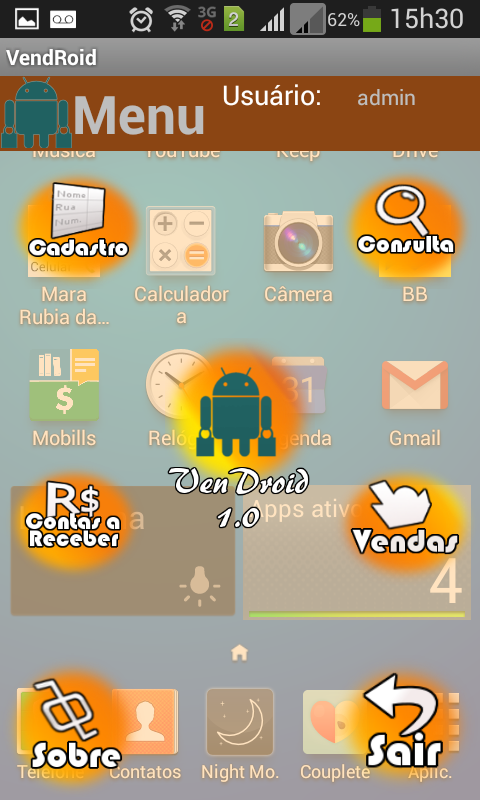
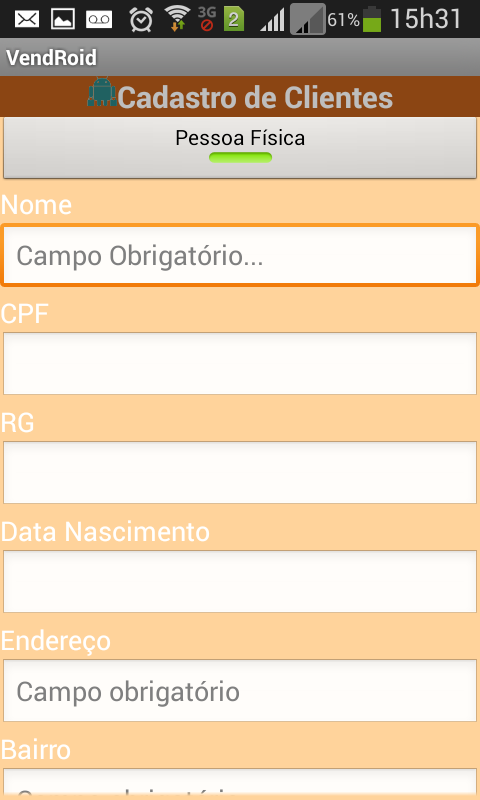

# Warning

This is the first time I've attempted to develop to Android, so the code is pretty messy and the app is unstable, but usable. I'll return to this repo in the future to refactor the whole application. But for now, use it in your own risk.

# Vendroid

Android app to manage clients, inventory, sales and more! The app it is in PT-BR.

<table>

	<tr>

		<td></td>
		<td></td>

	</tr>	

</table>

# I want to use

I the ``dist`` folder you'll find ``vendroid-debug.apk``. Just download it to your mobile and install it. 

# Contribute

To contribute to this repository just clone it to your local machine and open it in Eclipse with ADT plugin or import the project with Android Studio. It doesn't have any external library.

# License

GNU GENERAL PUBLIC LICENSE V.3